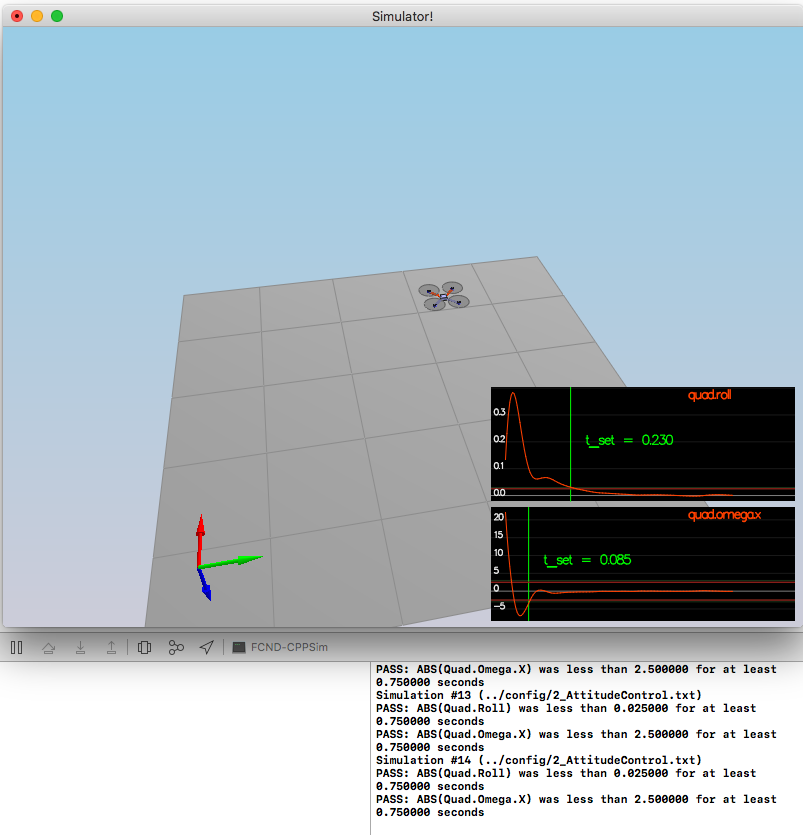
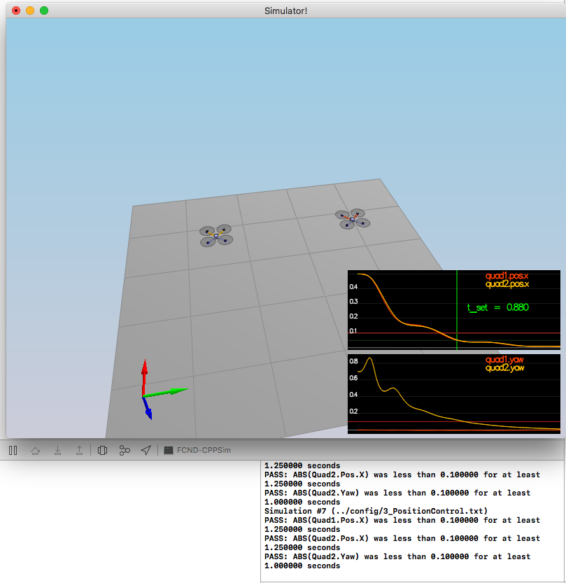
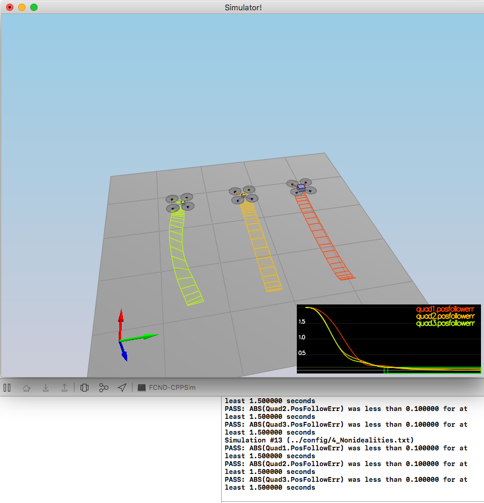
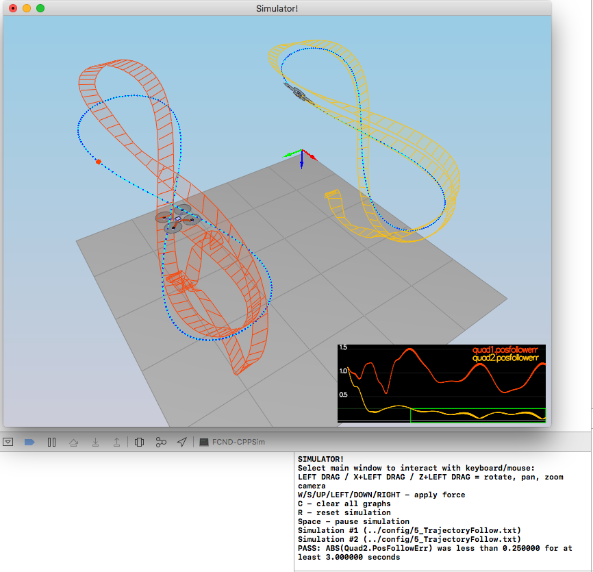

# Control of a Quadrotor in 3D #

## The Tasks ##

### Body rate and roll/pitch control (scenario 2) ###

The functions `GenerateMotorCommands()`, and `BodyRateControl()` were
implemented successfully. 

The major difficulty stemmed from the fact that the project or code
does not apparently describe what is the rotation direction of each
rotor. I needed to figure out this through experiments with the
simulator, which took me to realize that I needed to change one sign in
the equation for the moment about Z relative to the equations provided
in the theoretical part. 

Implementing `RollPitchControl()` was also tricky since the equations
provided by Udacity (essentially those in the paper by Schoellig et
al.) assume that the z-axis points up, and the course did not provide
us with the understanding necessary to find the required equations in
the case where the z-axis points down, as necessary in this project.
After some trouble, I managed and solved this issue by changing the
signs of the x and y accelerations.

I kindly suggest to the Udacity team that this part of the project
specification or course contents be improved to avoid unnecessary
struggle to students.

The parameters were tuned successfully to pass these tests, as shown
below. 

### Position/velocity and yaw angle control (scenario 3) ###

Functions `LateralPositionControl()` and `AltitudeControl()` were
implemented. The second was coded initially using a PD controller. 

Function `YawControl()` was also implemented without difficulty. 

The parameters were tuned successfully to pass these tests, as shown
below. 

### Non-idealities and robustness (scenario 4) ###

Function `AltitudeControl()` was edited to include integral control. 

The biggest challenge was to tune the parameters. After hours, I
managed to find a set of parameters passing all tests.  I had to go
back and forth through all scenarios until all of them were passed
with the same set of parameters.

### Tracking trajectories ###

The challenge here was to find a suitable set of parameters. With the
parameters I had from before, the quads were crashing. Since the
drones still had to go through the previous tests, I did not want to
modify many parameters. In the end, I found a suitable set of
parameters by tuning just the parameters for control of z. All
previous tests are still passed. 

